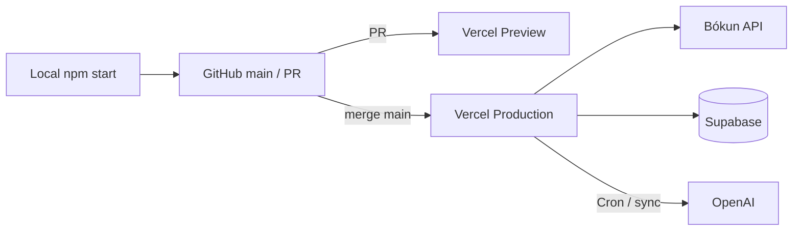

# Deployment guide — recommended setup

This project is a **static UI kit + Vercel serverless APIs** (Bókun catalog, Supabase translations, image thumb). There is **no frontend build step**.

**Production:** https://djstour.com (Vercel project also serves on `djscla.vercel.app`)
**Vercel project:** `djscla` (GitHub: `djstour/djscla`)

See also: [VERCEL.md](./VERCEL.md) (dashboard URLs, env table), [BOKUN.md](./BOKUN.md) (local dev), [TRANSLATIONS.md](./TRANSLATIONS.md), [VENDOR_SCALE.md](./VENDOR_SCALE.md) (when SKU grows), [OTA_API.md](./OTA_API.md) (productization routes).

---

## Recommended approach (summary)

| Layer | Choice |
|-------|--------|
| Hosting | **Vercel** — static files + `api/*` + Cron |
| Source control | **GitHub** — `main` → Production; PRs → Preview |
| Catalog & booking API | **Bókun** (keys only on server) |
| 繁中 / 简中 copy | **Supabase** `translations` + optional `data/bokunTranslations.js` |
| Local dev | `npm start` (`scripts/dev.mjs` loads `.env.local`) |
| Plan | **Vercel Pro** for translation Cron + 300s functions |

Do **not** replace Vercel with a plain static server for production — `/api/catalog/*` and `/api/media/thumb` will not exist.

---

## Architecture



**What Vercel serves**

| Path | Content |
|------|---------|
| `/` | UI kit (`vercel.json` rewrites → `ui_kits/web/index.html`) |
| `/preview/*` | Design system cards |
| `/api/catalog/activities` | Bókun catalog (paginated / `all=true`) |
| `/api/bokun/activity` | Bókun detail |
| `/api/availability/check` | Single-date availability + price summary |
| `/api/checkout/questions` | Checkout question contract (preview skeleton) |
| `/api/inquiries` | Concierge lead capture → Supabase |
| `/api/media/thumb` | WebP proxy for Bókun S3 images |
| `/api/translations/*` | Sync + Cron |

Product photos live on **Bókun S3** (URLs in API responses), not in this repo. Brand assets: `assets/*.svg`.

---

## Environments

### Production

- **Primary URL:** https://djstour.com (custom domain) · Vercel project alias: `djscla.vercel.app`
- **Trigger:** push to `main` (if Git integration enabled) or `npm run deploy` → `npx vercel --prod`
- **Vercel settings:** Framework **Other**, **empty** Build Command and Output Directory

### Preview

- Each PR / branch gets a Preview URL
- Use **Preview** environment variables in Vercel (sandbox Bókun keys optional)
- Verify UI + `/api/catalog/activities` before merging to `main`

### Local

```bash
cp .env.example .env.local   # BOKUN_ACCESS_KEY + BOKUN_SECRET_KEY from Bókun dashboard
npm start                    # http://localhost:3000
```

- `vercel env pull` defaults to **Development** and **cannot read Sensitive** Bókun keys — paste keys manually into `.env.local` ([BOKUN.md](./BOKUN.md)).
- `npm run preview:static` — CSS/layout only; **no** catalog API.

---

## Environment variables (Production)

Set in [Vercel → djscla → Settings → Environment Variables](https://vercel.com/djstours-projects/djscla/settings/environment-variables).

| Variable | Required | Scope |
|----------|----------|--------|
| `BOKUN_ACCESS_KEY` | Yes | Preview + Production |
| `BOKUN_SECRET_KEY` | Yes | Preview + Production |
| `BOKUN_API_HOST` | Yes | `https://api.bokun.io` (live keys) |
| `SUPABASE_URL` | Yes | API reads translations |
| `SUPABASE_ANON_KEY` | Yes | API reads translations |
| `SUPABASE_SERVICE_ROLE_KEY` | Sync / Cron | Writes `translations` |
| `OPENAI_API_KEY` | Sync / Cron | Translation worker |
| `TRANSLATION_SYNC_SECRET` | Sync | `POST /api/translations/sync` |
| `CRON_SECRET` | Cron | `/api/translations/cron` (can match sync secret) |
| `TRANSLATION_CRON_MAX_ACTIVITIES` | No | Default `12` per Cron run (Pro) |

Optional: `BOKUN_LANG`, `BOKUN_CURRENCY`, `OPENAI_TRANSLATION_MODEL` — see `.env.example`.

**Supabase ↔ Vercel:** [Supabase Integrations](https://supabase.com/dashboard/project/pmdfdkhfkjyuvucsfsoe/settings/integrations) → link project `djscla`.

---

## Deploy workflow

### Day-to-day

1. Develop with `npm start` and `.env.local`
2. Push branch → open PR → check **Vercel Preview**
3. Merge to `main` → **Production** auto-deploy
4. Smoke test:
   - https://djstour.com/
   - https://djstour.com/api/catalog/activities?lang=hant&all=true → `"source":"db"` (or `bokun` before first sync), `activities` array

### CLI (optional)

```bash
npx vercel login
npx vercel link --project djscla
npm run deploy   # production
```

### Background jobs (not every deploy)

| Task | How |
|------|-----|
| Translation catch-up | Cron every 15m (`vercel.json`, 12h SLA) or `CHUNK=12 ./scripts/sync-all-translations.sh` |
| Chip ID cache | `npm run enrich:chips:api` or see [CHIP_IDS_AUTOMATION.md](./CHIP_IDS_AUTOMATION.md) |

Do **not** rely on one 300s function to translate the entire catalog in a single request.

---

## Vercel Pro recommendations

| Area | Setting |
|------|---------|
| Git | Production branch `main`, repo `djstour/djscla` |
| Cron | `*/15 * * * *` on `/api/translations/cron` (12h hant+hans SLA) |
| Functions | Translation routes use `maxDuration: 300` in code |
| Observability | Vercel **Logs** for `/api/*` failures |
| Domains | `djstour.com` (primary) + `djscla.vercel.app` (Vercel default alias) |

---

## What not to do

1. **Production on `python -m http.server` or static S3 only** — no Bókun proxy, no translations API.
2. **Commit `.env.local` or API keys** — use Vercel env + `.env.example` template.
3. **Depend on `?all=true` forever** — fine for ~123 SKU; migrate per [VENDOR_SCALE.md](./VENDOR_SCALE.md) Phase B when catalog &gt; ~2000 or multi-vendor full load.
4. **Run full translation sync on every git push** — use Cron + incremental sync.
5. **Expect `vercel env pull` to fill Bókun keys** — Sensitive vars are not readable; copy from Bókun extranet.

---

## When to change architecture

| Trigger | Next step |
|---------|-----------|
| Single vendor, &lt; ~2000 SKU | **Stay on current Vercel + Bókun live API** (Phase A) |
| Full catalog slow / `all=true` timeout | [VENDOR_SCALE.md](./VENDOR_SCALE.md) Phase B — mirror catalog in Supabase, paginated `GET /api/catalog/activities` |
| ~1000 vendors / 50k+ rows | Phase C — search index (Typesense / Postgres FTS), vendor-scoped cache |

---

## Pre-launch checklist

- [ ] Vercel linked to `djstour/djscla`, Production branch `main`
- [ ] All required env vars set for **Production** (and Preview if used)
- [ ] `/api/catalog/activities?lang=hant&all=true` returns Bókun data
- [ ] Supabase `translations` populated (Cron or `sync-all-translations.sh`)
- [ ] Mobile detail + tours filters verified on Preview or Production
- [ ] Custom domain DNS → Vercel (when going live on brand domain)

---

## Where content lives (quick reference)

| Content | Location |
|---------|----------|
| UI chrome copy (buttons, nav) | `ui_kits/web/components/*.jsx` (`pick` hant/hans/en) |
| Product English | Bókun API |
| Product 繁中/简中 | Supabase `translations` + `data/bokunTranslations.js` (samples) |
| Product images | Bókun S3 URLs via API |
| Logo / gradients | `assets/` |
| Filter taxonomy | `lib/chipIds.js`, `data/chipIdsCache.json` |
| Image performance | [BOKUN_IMAGES.md](./BOKUN_IMAGES.md) |
